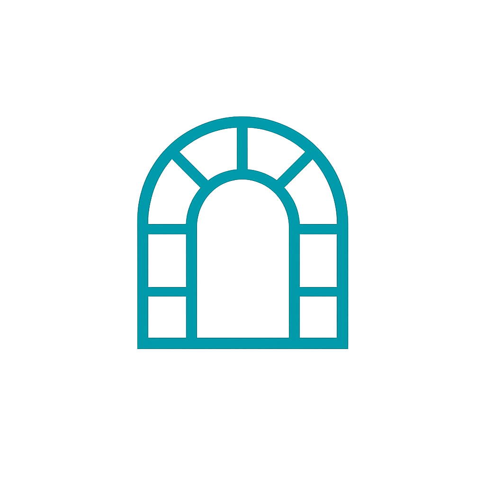

<p align="center">
  
</p>

**OpenArchi - An open-source ArchiMate modeling tool built for human & AI collaboration**

OpenArchi is a modern alternative to Archi. It provides an interactive canvas for visual architecture modeling, backed by the ArchiMate language by The Open Group along with a more agent-friendly layer in Markdown, making models readable and editable by humans and AI agents.

Built with React, Typescript and Vite and designed to be extended with AI agents (Claude, Codex and others) that can reason about, generate and refine architecture models alongside human architect. 

## Background
It all really started when I was working on another project and wanted to work with Archi on Linux. Since it's a community maintained package, there were some bugs and frustrations which led me to thinking - why is this tool still stuck in an older era? I know little about the React/Typescript ecosystem so I rely **a lot** on handholding from Claude, there might be bugs and issues of it's own in this tool! 

## Current limitations
- The browser build still depends on File System Access support for in-place writes; Firefox/Safari remain read-only there.
- Tauri desktop scaffolding is added, but packaging and distribution still need Rust/Tauri toolchains plus final app icons.
- There are still model import/export gaps such as `.archimate` archive save and specialization/profile support.

## Future features
- Markdown layer that translates ArchiMate for AI agents
- Code view, see either ArchiMate XML or Markdown side-by-side next to current view
- Comparasion view, showing changes that were done previously by others 
- Plan view, AI will create a pop out view with suggested model where you can further apply
- Natural language model generation
- Model versioning
- Multi-user editing sessions
- Model templates

## Quick Start

### Web

```bash
git clone <repo-url>
cd openarchi
pnpm install
pnpm dev
```

Opens at `http://localhost:3100`.

### Desktop (Tauri)

The Tauri layer exists to handle native concerns that the web build cannot do reliably:

- Read and write workspace files on disk without browser sandbox limits.
- Persist the currently opened workspace path and restore it on relaunch.
- Detect the current git branch from the opened workspace.
- Provide a place for future native features such as file watching, git operations, and heavier parsing/AI sidecars.

Prerequisites:

- Node.js + `pnpm`
- Rust toolchain (`rustup`, `cargo`, `rustc`)
- Platform prerequisites from the Tauri docs (WebKitGTK on Linux, Xcode tools on macOS, WebView2 on Windows)

Run desktop dev mode:

```bash
pnpm install
pnpm tauri:dev
```

Build the web app only:

```bash
pnpm build
```

Build the desktop app shell:

```bash
pnpm tauri:build
```

`src-tauri/tauri.conf.json` points Tauri at the existing Vite app, so the final app remains a React/Vite frontend with a Rust native backend handling filesystem-native operations.
